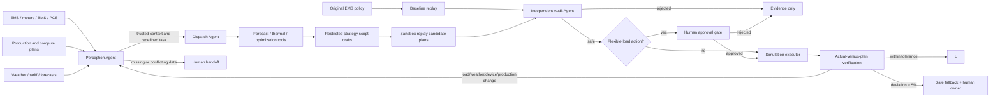

# EnergyMesh Agents Architecture

## Scope

EnergyMesh Agents performs day-ahead economic dispatch for one commercial park with load, rooftop
PV, and a battery. The default horizon is 96 quarter-hour intervals. It is deliberately above the
real-time protection and device-control layers.

## Trust boundaries

EnergyMesh is the autonomous coordination layer above existing EMS, production systems, forecasting
services, numerical optimizers, and scriptable policy authoring. When the operating situation changes,
the Dispatch Agent should author a restricted strategy script draft rather than merely select a
pre-baked policy. The script has no network, filesystem, import, approval, or equipment-write
permission. The auditor statically checks the script, replays it in a sandbox, and independently
recomputes SOC, power, transformer, grid-interconnection, temperature-derating, production-plan,
load-authorization, interval-balance, and baseline-improvement rules. The executor asserts the safe
runtime flags again before replay.

## Components

- `perception.py`: validates forecast cadence, device status, production minimum load, and active
  constraints; detects sensor conflict, determines whether the old task is still valid, prioritizes
  objectives, and selects required tools before optimization.
- `demo.py`: deterministic 96-point demo forecast and controlled operational-change injection.
- `optimizer.py`: linear economic dispatch solved by `scipy.optimize.milp`; in the strategy-script
  flow, it is a tool the Dispatch Agent may use while authoring a restricted policy script.
- `audit.py`: fail-closed script/static validation, sandbox replay checks, and an independent cost
  comparison against the original EMS policy.
- `orchestrator.py`: explicit task state machine and Agent responsibility boundaries.
- `simulator.py`: maps plans to idempotent EMS/PCS/load commands and confirms every interval using
  local simulated adapters; deviations above 5% activate a safe fallback and human ownership. It
  contains no network/device adapter.
- `storage.py`: SQLite task state and atomically written SHA-256 evidence packages.
- `api.py`: FastAPI endpoints and static operator console.
- `agentteams.py`: open-source AgentTeams Team, Worker, Skill, MCP, and trace mapping manifest.
- `agentteams/`: `agentscope-ai/AgentTeams` Team/Human YAML, SOUL.md, AGENTS.md, Worker, and
  Skill assets.

## Optimization model

Decision variables per interval are battery charge/discharge power, grid import, PV curtailment,
flexible-load shed, and SOC. A day-level peak variable represents maximum grid import.

The objective minimizes energy tariff, demand charge, battery throughput degradation, PV
curtailment, and flexible-load discomfort. Constraints enforce interval power balance, SOC
dynamics and bounds, charge/discharge limits, transformer and grid-interconnection capacity, PV
availability, temperature derating, production minimum load, and terminal SOC reserve.

This is a linear park-level energy balance. It is not AC/DC power flow, voltage analysis, fault
analysis, relay protection, or a battery electrochemical model.

## Strategy script flow

For new operational conditions or planning requests, Agent information flow is:

1. Perception Agent outputs trusted context, conflicts, objective priority, and tool needs.
2. Dispatch Agent writes restricted strategy script drafts and expected metrics.
3. Audit Agent performs static checks, sandbox replay, hard-constraint recomputation, and benefit
   comparison against the baseline.
4. Human Operator approves actions that affect production or flexible load.
5. Execution Agent maps only the approved script output to idempotent simulated commands.

See `docs/STRATEGY_SCRIPT_FLOW.md` for the detailed script boundary and evidence chain.

## API

- `GET /api/health`: runtime safety flags.
- `GET /api/agentteams/manifest`: `agentscope-ai/AgentTeams` Team/Worker/Skill/MCP manifest.
- `GET /api/demo/scenario`: committed demo scenario expanded to 96 points.
- `POST /api/demo/run`: generate, audit, and select candidate plans.
- `POST /api/tasks/{id}/approval`: approve or reject a gated plan.
- `POST /api/tasks/{id}/reoptimize`: derive a new child task after operational data changes.
- `GET /api/tasks` and `GET /api/tasks/{id}`: task/evidence retrieval.

API contracts are visible at `/docs` and can later be wrapped by MCP tools without changing the
domain pipeline. This version includes `agentscope-ai/AgentTeams` declarative resources and Worker
packages; EnergyMesh FastAPI remains the energy-domain tool/API layer behind the AgentTeams team.
