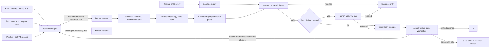

# EnergyMesh Agents Architecture

## 顶层设计：从 Multi-Agent Demo 到工业能源系统工程

EnergyMesh 的核心定位不是"用 Agent 做能源演示"，而是**面向工业园区、算力中心与储能场站的稳定运行与持续节能系统**。以下三件事是架构升级的关键：

1. **稳定性与部署架构**：云—边—端三层设计，边缘自治、断网可用；
2. **异常处理与安全降级**：五类异常工程化状态机，Fail-safe 不是 Fail-dead；
3. **数据质量、状态估计与细分计算方案**：八层确定性控制链，Agent 不直接决定物理设定值。

---

## 1. 部署架构：云—边—端三层

核心原则：**云挂了，现场不能跟着挂。**

### 1.1 三层拓扑

```text
                         EnergyMesh Cloud
                  ┌─────────────────────────────┐
                  │ Web Operator Console        │
                  │ AgentTeams / LLM (非安全关键)│
                  │ Historical data / Analytics │
                  │ Model training / Fleet mgmt │
                  │ Alarming & Maintenance      │
                  └──────────────┬──────────────┘
                                 │
                    非安全关键通信（容忍断网）
                                 │
                 ┌───────────────▼───────────────┐
                 │ EnergyMesh Edge Controller    │  ← 每台站点至少一台
                 │                               │
                 │  ◆ Data Quality Engine        │
                 │  ◆ Device Models (PhyAI)      │
                 │  ◆ State Estimator            │
                 │  ◆ Forecast Engine            │
                 │  ◆ Optimizer / MPC            │
                 │  ◆ Safety Rule Engine         │
                 │  ◆ Local Scheduler            │
                 │  ◆ Command Dispatcher         │
                 │  ◆ Readback Validator         │
                 │  ◆ Local DB / Cache           │
                 │  ◆ Watchdog                   │
                 └───────────────┬───────────────┘
                                 │
              OPC-UA / Modbus / MQTT / BACnet
                                 │
            ┌────────────────────▼─────────────────┐
            │ EMS / PCS / BMS / PLC / HVAC / SCADA │
            └────────────────────┬─────────────────┘
                                 │
                          Physical World
```

### 1.2 云—边—端职责矩阵

| 层级 | 职责 | 掉线影响 | 必须保留能力 |
|---|---|---|---|
| **Cloud** | 运维 UI、LLM Agent、模型训练、跨园分析 | Agent 不可用、交互降级 | 无（非安全关键） |
| **Edge** | 数据采集、状态估计、优化决策、安全校验、控制执行 | 整个站点失控 | 全部核心能力必须本地自治 |
| **Terminal** | 传感器数据采集、设备执行、本地安全联锁 | 设备失控 | PLC/SCADA 本地联锁必须独立 |

### 1.3 边缘主机最小规格

部署单元：**Docker Compose 或 K3s 单节点**

```yaml
# docker-compose.edge.yml 示意
services:
  energymesh-edge:
    image: energymesh/edge:latest
    volumes:
      - ./edge-data:/data
    environment:
      - CLOUD_ENDPOINT=https://cloud.transrealm.ltd
      - EDGE_AUTONOMY_MODE=true   # 断网时自动切换
  optimizer:
    image: energymesh/optimizer:latest
    # 本地 MIP 求解器，不依赖云端
  device-adapters:
    image: energymesh/adapters:latest
    # OPC-UA / Modbus 网关
  timeseries-db:
    image: influxdb:2.7
    # 边缘缓存最近 7 天数据
  rule-engine:
    image: energymesh/safety-rules:latest
    # 纯确定性规则，无 LLM
  watchdog:
    image: energymesh/watchdog:latest
    restart: always
    # 周期性检测各组件心跳，异常时触发降级
```

硬件最小规格：x86 工业计算机或 NUC，16GB RAM，256GB SSD，2 网口（业务 + 管理），无风扇/宽温选型。也可部署在现有园区虚拟化平台。

### 1.4 AgentTeams 的正确位置

```text
Cloud / Edge orchestration layer
        ↓（发现、协调、解释、通知人）
确定性控制层（Data Quality → State Estimation → Optimizer → Safety Rules）
        ↓（设定值）
设备执行层（PCS / PLC / EMS）
```

AgentTeams 负责**发现"发生了什么"、调用正确能力、组织任务、通知人、解释原因**；不直接产生物理设定值。

---

## 2. 异常处理与安全降级

核心原则：**Fail-safe，不是 Fail-dead。**

异常拆分为五类工程化处理链路：

### 2.1 A 类：数据异常

**处理链：**
```
收到原始数据
  → 格式验证（schema）
  → 范围检查（range）
  → 时间连续性检查（freshness, cadence）
  → 变化率检查（rate of change）
  → 跨测点一致性检查（cross-sensor）
  → 物理一致性检查（physical laws）
  → 可信度评分（confidence score 0-1）
  → 标记 valid / degraded / invalid
```

**示例（物理不一致）：**

输入：SOC[t]=55%，15min 后 SOC[t+1]=5%，PCS 功率=-100kW，电池容量=2MWh。

物理验证：15min 内最大放电量 = 100kW × 0.25h = 25kWh。
SOC 下降 = (0.55 - 0.05) × 2000kWh = 1000kWh。
1000kWh ≠ 25kWh → **DATA_INVALID_PHYSICAL_INCONSISTENCY**

**结果：** 保留上一可信状态、禁止执行新策略、进入降级模式、告警通知。

### 2.2 B 类：设备异常

**处理：** 设备状态 = unavailable → 从可控资源集合删除 → 重新构造优化问题 → 重新求解。

**示例：**

原有可用资源：{Battery A: 500kW, Battery B: 500kW}
B 掉线后：available_assets = {Battery A: 500kW}
优化器必须重新计算最优策略，而不是基于旧集合执行减半动作。

### 2.3 C 类：预测异常

**定义：** `forecast_error = |actual - forecast| / forecast`

**处理：**
```
forecast_error > threshold
  → 当前 plan_version 标记 superseded
  → 重新生成 forecast
  → 重新进入 Dispatch→Audit 链路
```

这是"天气突变触发重规划"的数学版本。

### 2.4 D 类：控制执行异常

**定义：** `execution_error = |command - actual| / |command|`

**处理：**
```
execution_error > 5%（可配置）
  → VERIFY_FAILED
  → 停止继续扩大控制动作
  → 检查设备能力 / 通讯 / 状态
  → rollback 或 replan
```

### 2.5 E 类：系统级异常

每个子系统有独立降级策略：

| 异常 | 降级策略 |
|---|---|
| LLM 不可达 | 优化器继续运行（无 Agent 介入），预定义规则接管 |
| AgentTeams 断开 | 本地 Scheduler（确定性策略）继续 |
| 云断网 | Edge Local Mode（完全自治） |
| 优化器超时 | 回退最近安全策略（最近一次通过 Audit 的计划） |
| 数据可信度不足 | 禁止自动控制，切人工 |
| PCS 通讯失败 | 保持当前安全设定，通知现场 PLC 本地控制 |
| Edge 程序崩溃 | Watchdog 重启并回退最近安全策略 |

---

## 3. 数据质量、状态估计与细分计算方案

核心原则：**LLM/Agent 不直接决定物理设定值。**

### 3.1 数据八大分层

| 层级 | ID | 内容 | 来源 |
|---|---|---|---|
| Telemetry | D01 | SOC、PCS power、温度、负荷、PV 功率等实时遥测 | 传感器、EMS |
| Asset Model | D02 | 装机容量、容量、最大充放电功率、SOC 上下限、温度限值 | 设备铭牌、调试数据 |
| Forecast | D03 | PV、负荷、气温、电价等预测 | 气象服务、预测模型 |
| Tariff | D04 | 峰谷平电价、需量电费、需求响应补贴 | 电网/售电公司 |
| Constraint | D05 | 变压器容量上限、生产最小负荷、并网上限 | 园区运维/生产计划 |
| Command | D06 | 下发给 PCS/PLC 的设定值 | 优化器输出 |
| Readback | D07 | 设备实际执行回读 | 传感器/EMS |
| Derived State | D08 | 计算得出的派生状态 | 状态估计器 |

### 3.2 八层确定性控制计算链

每一台设备的控制指令必须经过以下八层后，才敢真正下发：

```
① 数据检查      → ② 状态计算      → ③ 可用能力
   (valid?         (net_load,       (available
    online?         remaining)        energy)
    range?)
         ↓
④ 控制边界   → ⑤ 经济优化       → ⑥ 安全审核
 (P ≤ min{PCS,      (min Σ         (SOC ≥ SOC_min?
  battery,            tariff[t]     grid ≤ limit?
  transformer,        × import)     demand ≥
  available})                        protected?)
                          ↓
                     ⑦ 下发       →    ⑧ 回读验证
                  (PCS_SETPOINT)      (cmd-actual
                                        error<5%?)
                          ↓
                    PASS → 更新 Derived State
                    FAIL → rollback / alarm
```

### 3.3 储能设备计算示例

**原始数据（D01 Telemetry）：**
- SOC = 56%
- PCS power = -320 kW（充电）
- battery temp = 31°C
- load = 3.8 MW
- PV = 1.2 MW

**静态参数（D02 Asset Model）：**
- capacity = 2 MWh
- max discharge = 800 kW
- SOC_min = 20%, SOC_max = 95%

**执行链：**

| 层 | 计算 | 结果 |
|---|---|---|
| ① 数据检查 | SOC valid？temp < limit？PCS online？ | all PASS |
| ② 状态计算 | net_load = load - PV | = 2.6 MW |
| ③ 可用能力 | available = (SOC - SOC_min) × capacity | = 0.72 MWh |
| ④ 控制边界 | P_d ≤ min(800, 500 PCS, transformer, 0.72/Δt) | = 500 kW |
| ⑤ 经济优化 | min Σ tariff[t] × grid_import[t] | 优化求解 |
| ⑥ 安全审核 | SOC≥20%, grid≤limit, demand≥protected | PASS |
| ⑦ 下发 | PCS_SETPOINT = -500 kW（放电） | 已下发 |
| ⑧ 回读 | actual = -487 kW, error = 2.6% | **PASS** |

---

## Scope

EnergyMesh Agents performs day-ahead economic dispatch for one commercial park with load, rooftop
PV, and a battery. The default horizon is 96 quarter-hour intervals. It is deliberately above the
real-time protection and device-control layers.

## Trust boundaries



EnergyMesh is the autonomous coordination layer above existing EMS, production systems, forecasting
services, numerical optimizers, and scriptable policy authoring. When the operating situation changes,
the Dispatch Agent should author a restricted strategy script draft rather than merely select a
pre-baked policy. The script has no network, filesystem, import, approval, or equipment-write
permission. The auditor statically checks the script, replays it in a sandbox, and independently
recomputes SOC, power, transformer, grid-interconnection, temperature-derating, production-plan,
load-authorization, interval-balance, and baseline-improvement rules. The executor asserts the safe
runtime flags again before replay.

## Components

- `perception.py`: validates forecast cadence, device status, production minimum load, and active
  constraints; detects sensor conflict, determines whether the old task is still valid, prioritizes
  objectives, and selects required tools before optimization.
- `demo.py`: deterministic 96-point demo forecast and controlled operational-change injection.
- `optimizer.py`: linear economic dispatch solved by `scipy.optimize.milp`; in the strategy-script
  flow, it is a tool the Dispatch Agent may use while authoring a restricted policy script.
- `audit.py`: fail-closed script/static validation, sandbox replay checks, and an independent cost
  comparison against the original EMS policy.
- `orchestrator.py`: explicit task state machine and Agent responsibility boundaries.
- `simulator.py`: maps plans to idempotent EMS/PCS/load commands and confirms every interval using
  local simulated adapters; deviations above 5% activate a safe fallback and human ownership. It
  contains no network/device adapter.
- `storage.py`: SQLite task state and atomically written SHA-256 evidence packages.
- `api.py`: FastAPI endpoints and static operator console.
- `agentteams.py`: open-source AgentTeams Team, Worker, Skill, MCP, and trace mapping manifest.
- `agentteams/`: `agentscope-ai/AgentTeams` Team/Human YAML, SOUL.md, AGENTS.md, Worker, and
  Skill assets.

## Optimization model

Decision variables per interval are battery charge/discharge power, grid import, PV curtailment,
flexible-load shed, and SOC. A day-level peak variable represents maximum grid import.

The objective minimizes energy tariff, demand charge, battery throughput degradation, PV
curtailment, and flexible-load discomfort. Constraints enforce interval power balance, SOC
dynamics and bounds, charge/discharge limits, transformer and grid-interconnection capacity, PV
availability, temperature derating, production minimum load, and terminal SOC reserve.

This is a linear park-level energy balance. It is not AC/DC power flow, voltage analysis, fault
analysis, relay protection, or a battery electrochemical model.

## Strategy script flow

For new operational conditions or planning requests, Agent information flow is:

1. Perception Agent outputs trusted context, conflicts, objective priority, and tool needs.
2. Dispatch Agent writes restricted strategy script drafts and expected metrics.
3. Audit Agent performs static checks, sandbox replay, hard-constraint recomputation, and benefit
   comparison against the baseline.
4. Human Operator approves actions that affect production or flexible load.
5. Execution Agent maps only the approved script output to idempotent simulated commands.

See `docs/STRATEGY_SCRIPT_FLOW.md` for the detailed script boundary and evidence chain.

## API

- `GET /api/health`: runtime safety flags.
- `GET /api/agentteams/manifest`: `agentscope-ai/AgentTeams` Team/Worker/Skill/MCP manifest.
- `GET /api/demo/scenario`: committed demo scenario expanded to 96 points.
- `POST /api/demo/run`: generate, audit, and select candidate plans.
- `POST /api/tasks/{id}/approval`: approve or reject a gated plan.
- `POST /api/tasks/{id}/reoptimize`: derive a new child task after operational data changes.
- `GET /api/tasks` and `GET /api/tasks/{id}`: task/evidence retrieval.

API contracts are visible at `/docs` and can later be wrapped by MCP tools without changing the
domain pipeline. This version includes `agentscope-ai/AgentTeams` declarative resources and Worker
packages; EnergyMesh FastAPI remains the energy-domain tool/API layer behind the AgentTeams team.
