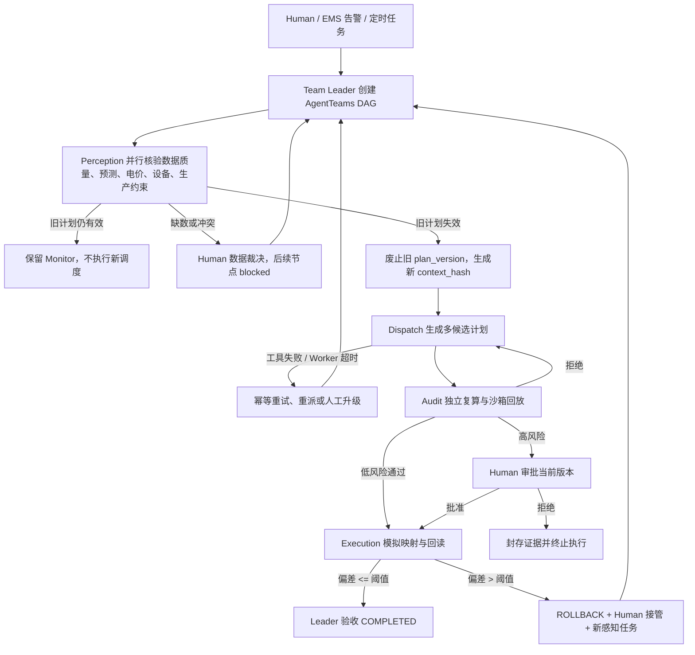
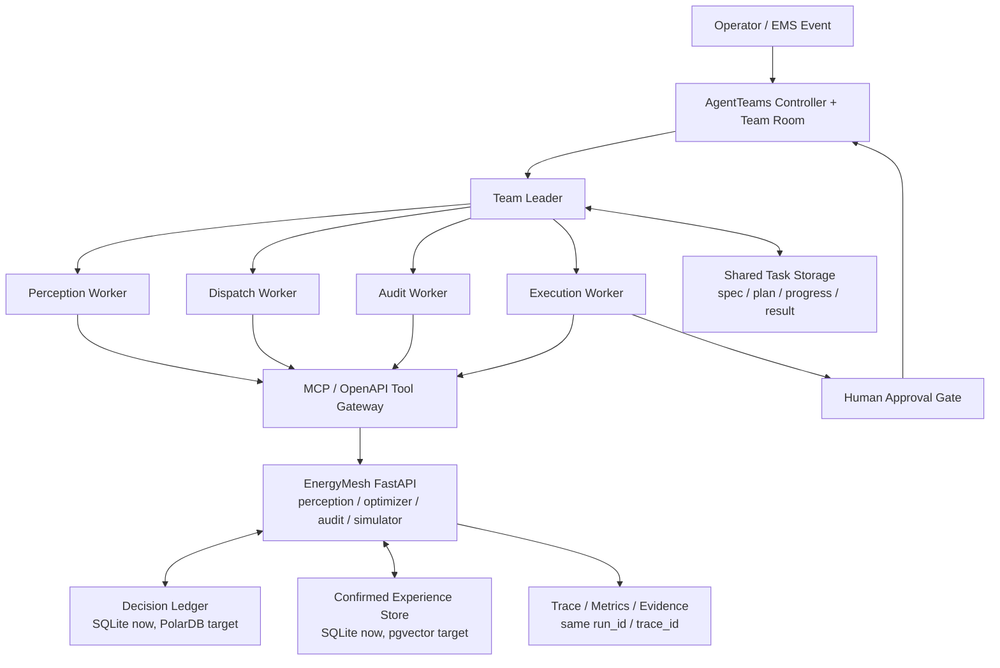

# EnergyMesh Agents -超境创新

> GOAI Agent Infra｜新智基座
> 
> 面向工业园区、算力中心、微电网与储能场站的 多Agent 电力调度持系统。

> 项目以官方 `agentscope-ai/AgentTeams` 为协同底座，目的是使用 多Agent 调度更有效地使用能源，持续降低能源成本和调度工作中的人工成本。


[超境创新官网](https://transrealm.ltd/energymesh-official?view=solutions) ·
[AgentTeams 资源](agentteams/) · [架构](ARCHITECTURE.md) · [当前状态](STATUS.md) ·
[安全边界](SECURITY.md)


## 我们想解决什么问题

大型园区、算力中心和工业微电网的调度失败和低效，通常是因为现实用户需求的多样性和现实运行在持续
变化：用户的生产需求，售电供电需求业务实际需求的改变，客观现实例如天气突变会让光伏预测失效，生产订单会临时改变负荷，分时电价和需量电费会放大错误决策，储能 SOC、
变压器温度、并网功率和关键产线保供又给调度加上硬约束。

传统 EMS 或人工排班常见的问题是制定调度代码需要收集多方信息，一次制定后修改麻烦，用来制定的 计划、预测、电价、设备状态和审批记录这些信息分散在不同系统里；旧计划持续判断并且微调优化非常耗费人工；这些问题会带来真实代价：高峰错付、光伏弃电、储能过充过放、关键负荷误削、
生产返工、设备热风险和审计不可追溯。

EnergyMesh 要解决的是持续利用Ai和Agent通过负责拆分数据采集 审批等等信息，持续优化调度和应对客户的个性化需求，持续保持电力调度的最高效率。


## 我们是如何解决的

 EnergyMesh Agents 采用 AgentTeams 作为协同底座，首先核心是Perception Agent读取数据定时监测园区，Team Leader 理解用户意图和生产需求，其余等等多个Agent分工，实现比如产生调度方案，审核，安全保障等等持续实现调度计划的更新，并且持续优化，达到降本的效果。
 这个过程中，由于真实电力调度场景中，数据采集和集中分析的复杂性，调度方案制定的复杂性，审核和安全防范的硬性要求，导致单一Agent完成此任务较为复杂，而分工明确的多Agent团队恰好可以解决这一问题。

AgentTeams 在系统中承担任务组织和责任分离：

- Team Leader 根据告警、上传数据或人工目标创建调度任务，维护任务 DAG、上下文版本和终态验收。
- Perception Agent 只读 EMS/BMS/PCS/气象/MES 数据，判断旧计划是否失效，并输出可信 `context_hash`。
- Dispatch Agent 在可信上下文上调用优化器生成候选计划，但无权审批或执行。
- Audit Agent 独立复算 SOC、变压器、并网、生产连续性和收益，危险方案默认拒绝。
- Human gate 只在高风险动作、柔性负荷影响或数据冲突时进入链路，审批绑定当前 `task_version` 和
  `context_hash`。
- Execution Agent 只执行当前获批版本，生成幂等命令、模拟回执和执行后偏差校验。

这套结构让系统能动态协作：如果数据正常，Leader 保持监控而不打扰 Worker；如果天气、电价、负荷或设备状态
突变，旧 plan_version 被废止，Dispatch 重新生成候选，Audit 重新审核，必要时再次请求人工审批；如果执行
回读偏差超限，系统进入 rollback 并创建新的感知任务。

当前仓库包含两层能力：

| 层级 | 当前实现 | 运行边界 |
| --- | --- | --- |
| AgentTeams 协作层 | `agentteams/` 中的 Worker/Human/Team 资源、Worker 包、Skill 契约和动态任务规则 | live 运行时由官方 AgentTeams、Matrix 房间、Human/admin 身份、Manager 和 Worker 共同产生协作记录 |
| 能源领域工具层 | FastAPI、优化器、审核器、模拟执行器、SQLite/JSON evidence、RAG 原型、3D 操作台 | 可在干净环境复现能源业务闭环，并作为 AgentTeams Worker 的业务工具和可视化客户端；不能替代 AgentTeams 协作证据 |

## Live AgentTeams 深度接入

EnergyMesh 现在把 **AgentTeams 当成真实运行引擎和事件源**，把 **EnergyMesh 界面当成业务可视化客户端**。

也就是说，AgentTeams Element 不是最终产品 UI，它是原生协作/证据界面；EnergyMesh  UI 才是面向园区能源运营的主界面。两者必须看到同一条真实任务链：

```text
AgentTeams Matrix / Team Room
        ├── AgentTeams Element：原生聊天室、Worker 记录、任务房间证据
        └── EnergyMesh FastAPI：业务客户端，发送 world_state，镜像 AgentTeams 事件
                 ↓
            EnergyMesh 白色 UI
                 ├── AI 对话
                 ├── 当前 AgentTeams 任务
                 ├── Worker 状态和时间线
                 ├── 调度方案预览
                 ├── 人工采用/执行
                 └── Three.js 园区电力流动
```

当前实现要点：

- 上传真实园区 CSV 或连接园区数据源后，右侧白色 UI 接入当天 96 点负荷、光伏、储能、电价和生产约束；
  虚拟园区、3D 电流、折线图和运行账本随真实时间/回放游标呈现当天电力调度情况。
- 用户在 EnergyMesh 左侧和 Team Leader 对话。启用 `AGENTTEAMS_LIVE_REQUIRED=true` 时，
  `/api/runtime/chat` 和 `/api/runtime/chat/stream` 均进入真实 AgentTeams Matrix 房间；
  EnergyMesh 使用 human/admin Matrix token 发言，并以 Matrix reply 形式回复最近一条 manager 消息。
- 用户明确要求“调度 / 优化 / 模拟 / 预览 / 采用 / 执行”时，Team Leader 联系数据/感知、
  调度、审核、安全/执行等 Agent 协同思考；普通问答仍保留 human → manager 的真实对话链。
- 上传 CSV 后，右侧园区状态会组成 `world_state`，随消息写入 AgentTeams Team Room，成为 Worker
  生成方案的真实输入。
- 后端将 AgentTeams 事件标准化为 `task_created`、`worker_joined`、`tool_call`、`dispatch_plan`、`audit_verdict`、`awaiting_approval`、`execution_receipt`、`completed`、`failed`。
- 白色 UI 的“AgentTeams 当前任务”区域展示真实 `project_id`、`task_id`、`team_room_id`、`task_room_id`、`worker_id` 和时间线。
- `dispatch_plan` 到达时才驱动 Three.js 预览，并展示购电成本下降、能源浪费下降、人工调度成本下降；
  `execution_receipt` 或完成事件到达后才正式采用预览。
- 右侧弹出的“采用方案/拒绝采用”是人工审批入口；采用、执行、回读、偏差、回退都会沉淀为同一条证据链。
- Agent 协同必须产生利于整个园区运行的调度方案，而不是只输出静态报告。
- 外部条件变化时，系统更新 `context_hash`，标记旧方案失效并说明理由，重新调度、重新审核；
  涉及生产负荷或安全约束时重新进入 Human Approval，执行偏差超限时进入 rollback。
- 每一版预测、电价、调度版本、下发结果和后续观测都保存为可追踪记录；事件会保存为
  `runtime_artifacts`，刷新页面后可通过 `task_id` 恢复，不只依赖浏览器 SSE。
- 负荷预测、成本估算和功率设定由结构化遥测、预测模型、优化器和现场安全规则重新计算；
  RAG 只用于解释已确认的历史偏差、约束触发、人工调整和最终结果，不直接决定调度功率。
- PolarDB 目标架构承载园区持续产生的遥测质量、负荷/光伏预测、电价、储能状态、生产约束、
  调度版本、下发结果和后续观测，并按同一决策时点形成完整快照。
- MCP 鉴权、工具失败处理、Agent/Skill 版本管理、评测发布、运行告警、SLO、容量和灾备方案
  是工程化验收项；当前仓库提供可核验源码、AgentTeams/Skill 资源、调度工具和外部接口契约。
- EnergyMesh 可以据此形成跨日滚动决策、执行后闭环验证和跨园区经验复用；跨园区策略必须按设备能力、
  生产约束和安全边界重新筛选，不能直接复用旧园区结论。

Element 和 EnergyMesh 的关系：

| 入口 | 作用 | 
| --- | --- | 
| AgentTeams Element | 原生 Matrix/Team Room，证明 Worker、任务房间、提交、验收真实存在 | 
| EnergyMesh 白色 UI | 园区电力调度主界面，展示电流流动、成本、浪费、审批和执行 | 


本仓库默认 `AGENTTEAMS_LIVE_REQUIRED=true`。也就是说，如果官方 AgentTeams runtime 没准备好，`/api/runtime/chat` 和 `/api/runtime/chat/stream` 会返回明确错误。

DeepSeek 或其他 OpenAI-compatible 模型配置在 AgentTeams Manager/Worker runtime 和 EnergyMesh
Team Leader 网关中，不配置在 Element。Element 是 AgentTeams 的 Matrix 聊天客户端，只显示房间、消息和
Worker 协作记录；真正调用模型的是 AgentTeams manager/worker 容器。


### Codespaces 最小演示环境

本项目已经在 GitHub Codespaces 跑通真实 AgentTeams 最小环境。证据见 [`evidence/agentteams-codespaces-proof.md`](evidence/agentteams-codespaces-proof.md)。

已验证的最小结构：

```text
AgentTeams official runtime v1.2.3
controller: agentteams-embedded
manager: agentteams-manager-qwenpaw
worker: agentteams-qwenpaw-worker
team: energymesh-demo
model: deepseek-chat via openai-compatible gateway
```

从零准备 Codespaces：

```bash
gh auth refresh -h github.com -s codespace
gh codespace create -R ArisLiWind/energymesh-agents -b main -m basicLinux32gb \
  --display-name energymesh-agentteams-min --idle-timeout 30m --retention-period 24h
```

在 Codespace 内安装最小 AgentTeams：

```bash
cd /workspaces
git clone --depth 1 https://github.com/agentscope-ai/AgentTeams.git AgentTeams
cd /workspaces/AgentTeams

set -a
. /workspaces/energymesh-agents/.env.agentteams.local
set +a

IMG=higress-registry.cn-hangzhou.cr.aliyuncs.com/agentteams/agentteams-qwenpaw-worker:v1.2.3
AGENTTEAMS_NON_INTERACTIVE=1 \
AGENTTEAMS_UPGRADE_KEEP_ALL=1 \
AGENTTEAMS_DASHBOARD=0 \
AGENTTEAMS_MATRIX_E2EE=0 \
AGENTTEAMS_MOUNT_SOCKET=1 \
AGENTTEAMS_INSTALL_WORKER_IMAGE=$IMG \
AGENTTEAMS_INSTALL_COPAW_WORKER_IMAGE=$IMG \
AGENTTEAMS_INSTALL_QWENPAW_WORKER_IMAGE=$IMG \
AGENTTEAMS_INSTALL_HERMES_WORKER_IMAGE=$IMG \
bash ./install/agentteams-install.sh
```

创建最小 EnergyMesh Team/Worker：

```bash
docker exec agentteams-controller agt create worker \
  --name energy-dispatcher \
  --runtime qwenpaw \
  --model deepseek-chat \
  --soul 'You are EnergyMesh Dispatch Worker. Produce verifiable campus energy dispatch plans from world_state JSON. Optimize purchased electricity cost, curtailment/waste, and manual dispatch labor. Return concise actions with expected savings.' \
  --wait-timeout 5m

docker exec agentteams-controller agt create team \
  --name energymesh-demo \
  --leader-name energy-dispatcher \
  --description 'EnergyMesh campus dispatch demo team using DeepSeek-backed AgentTeams and one qwenpaw Worker.'

docker exec agentteams-controller agt get teams
docker exec agentteams-controller agt get workers
```

本机打开 AgentTeams Element 证据界面：

```bash
gh codespace ports forward 18088:18088 18080:18080 -c <codespace-name>
```

然后打开：

```text
http://127.0.0.1:18088/#/login
```

Homeserver:

```text
http://127.0.0.1:18080
```


真实运行必须准备：

```bash
# 1. 安装并启动 Docker Desktop
docker ps

# 2. 安装官方 AgentTeams
git clone https://github.com/agentscope-ai/AgentTeams.git
cd AgentTeams
AGENTTEAMS_LLM_API_KEY=<your-model-key> make install

# 3. 回到 EnergyMesh 仓库，创建真实 Worker/Human/Team
scripts/setup_live_agentteams.sh

# 4. 配置 FastAPI 到 AgentTeams Team Room
export AGENTTEAMS_LIVE_REQUIRED=true
export AGENTTEAMS_TEAM_ROOM_ID=<matrix-room-id-created-by-agentteams>
export AGENTTEAMS_MATRIX_BASE_URL=<matrix-client-base-url>
export AGENTTEAMS_MATRIX_ACCESS_TOKEN=<matrix-access-token-for-fastapi-bridge>
# 可选：如果没有专用 SSE bridge，EnergyMesh 会直接轮询 Matrix Team Room
export AGENTTEAMS_EVENT_STREAM_URL=<optional-agentteams-event-sse-url>

# 5. 验证 EnergyMesh 只认真实 runtime
scripts/agentteams_runtime_check.sh
curl http://127.0.0.1:8000/api/agentteams/runtime
```

如果不希望在本机安装 Docker，也可以 Docker 和官方 AgentTeams 部署到腾讯云 CVM，本机 FastAPI/UI 只连接远端 Team Room 与事件流。完整步骤见 [`docs/deployment/tencent-cloud-agentteams.md`](docs/deployment/tencent-cloud-agentteams.md)，云端 bootstrap 脚本为 [`scripts/tencent_cloud_agentteams_bootstrap.sh`](scripts/tencent_cloud_agentteams_bootstrap.sh)。

`/api/agentteams/runtime` 会返回 `bridge_user_id`，用于确认 EnergyMesh 当前是否以 human/admin 身份发言。
如果这个值是 `@manager`，说明 token 配错了，Element 里会出现 manager 替用户说话的错误语义。
正确状态应类似：

```json
{
  "ready": true,
  "mode": "remote_matrix_agentteams",
  "bridge_user_id": "@admin:matrix-local.agentteams.io:18080",
  "workers": ["energy-dispatcher"],
  "teams": ["energymesh-demo"]
}
```


### 启动 EnergyMesh 白色 UI 并接 AgentTeams

EnergyMesh 白色界面运行在本机或 Codespace 都可以。它不是替代 AgentTeams，而是作为另一个 Matrix/AgentTeams 业务客户端。

推荐只记一个启动口令：

```bash
scripts/start_agentteams_demo.sh
```

这个脚本会读取 `.env.agentteams.local`，检查 Codespace/远端 Matrix、AgentTeams Worker 和 Team Room，
启动 EnergyMesh 白色 UI，并打印 Element 证据入口。

需要先配置：

```bash
export AGENTTEAMS_RUNTIME_MODE=remote_matrix
export AGENTTEAMS_ENABLED=true
export AGENTTEAMS_LIVE_REQUIRED=true
export AGENTTEAMS_TEAM_NAME=energymesh-demo
export AGENTTEAMS_TEAM_ROOM_ID='!Gw8awHaQ0bFSxke5b5:matrix-local.agentteams.io:18080'
export AGENTTEAMS_MATRIX_BASE_URL=http://127.0.0.1:18080
export AGENTTEAMS_MATRIX_ACCESS_TOKEN=<matrix-access-token>
export AGENTTEAMS_REMOTE_WORKERS=energy-dispatcher

export AGENTTEAMS_LLM_PROVIDER=openai-compat
export AGENTTEAMS_OPENAI_BASE_URL=https://api.deepseek.com/v1
export AGENTTEAMS_DEFAULT_MODEL=deepseek-chat
export AGENTTEAMS_LLM_API_KEY=<deepseek-api-key>
```

`AGENTTEAMS_MATRIX_ACCESS_TOKEN` 必须是 human/admin 账号的 token，不能使用 manager token。使用
manager token 会导致 Element 里显示“manager 自己发起请求”，破坏 human → manager → Worker 的协作语义。
本地调试可用 Matrix 密码登录获取 admin token：

```bash
curl -sS http://127.0.0.1:18080/_matrix/client/v3/login \
  -H 'Content-Type: application/json' \
  -d '{"type":"m.login.password","identifier":{"type":"m.id.user","user":"admin"},"password":"<admin-password>"}'
```

EnergyMesh 发送消息时会自动读取最近一条 manager 消息，并通过 Matrix
`m.relates_to.m.in_reply_to.event_id` 发送为 reply；在 Element 中等价于点击 manager 消息右上角“回复”后输入。

如果不使用一键脚本，也可以手动启动：

```bash
SIMULATION_MODE=true ALLOW_PRODUCTION_WRITE=false \
.venv/bin/uvicorn energymesh.api:app --app-dir src --host 127.0.0.1 --port 8000
```

打开白色 UI：

```text
http://127.0.0.1:8000
```

### 正常进入 EnergyMesh Agents 的操作

AgentTeams 自带的 Element 页面是证据/协作聊天室，不是 EnergyMesh 的业务主界面。正常演示请同时开两个入口：

| 入口 | 地址 | 用途 |
| --- | --- | --- |
| EnergyMesh 白色 UI | `http://127.0.0.1:8000` | 主要操作入口：上传 CSV、看 3D 电流、发起调度、预览/采用方案 |
| AgentTeams Element | `http://127.0.0.1:18088/#/login` | 原生证据入口：查看同一 Team Room/Task Room 的 Worker 协同记录 |

Element 登录时 Homeserver 填：

```text
http://127.0.0.1:18080
```

用户名/密码使用当前 AgentTeams runtime 创建时的账号。登录后进入
`#agentteams-worker-energy-dispatcher:matrix-local.agentteams.io:18080` 或当前 Team Room。白色 UI 的
“AgentTeams 当前任务”面板会显示同一组 `project_id`、`task_id`、`team_room_id`、`task_room_id`
和 `worker_id`，用于和 Element 对账。

下次在另一个 Codespace 或机器重新打开仓库时，需要重新启动官方 AgentTeams、端口转发和
EnergyMesh FastAPI；Matrix 房间和 token 属于那次 AgentTeams runtime，不会只靠 GitHub clone 自动存在。
仓库保存的是接入代码、Worker/Team 资源、启动脚本和证据文档，不保存私密 access token 或模型 API key。

推荐演示动作：

1. 先上传 CSV 或加载演示数据，让右侧园区出现真实 `world_state`。
2. 左侧对 Team Leader 说：“帮我减少当前购电和限发，先预览调度方案。”
3. 白色 UI 应显示 AgentTeams 当前任务、Worker 时间线、world_state 已载入。
4. 真实 `dispatch_plan` 到达后，Three.js 进入预览。
5. 用户点击“采用方案”后，执行回执到达才正式更新园区电流和指标。

## 场景价值与完成条件

### 谁在用

目标用户是微电网用户；园区能源运营团队、算力中心基础设施运维团队、储能运营商、EMS/SCADA 集成商和需要削峰填谷的
园区或企业。现实流程通常是工程师从 EMS、BMS、PCS、光伏逆变器、气象、电价平台和 MES/生产计划中手工拼接
状态，判断旧策略是否失效，重跑优化或手调参数，再找负责人审批并下发到现场系统。

EnergyMesh 在这个流程中承担的是“协作调度与治理层”角色：

- 判断当前任务是否仍成立，避免用过期预测和旧审批继续执行。
- 把调度、审核、审批、执行权力拆开，降低单点误判带来的设备和生产风险。
- 将每次决策的输入、上下文版本、Skill 版本、工具返回、人工决定、执行回执和最终结果关联为同一条证据链。
- 在失败、冲突、超时或执行偏差时阻断或回退，而不是只生成一份建议书。

### 真实失败代价

| 现场痛点 | 不只是效率低 | EnergyMesh 的闭环控制 |
| --- | --- | --- |
| 数据源时间戳、质量和版本不一致 | 可能基于陈旧预测调度储能，造成过充过放、峰值误判或错过低价充电窗口 | Perception Agent 输出 `context_hash`、质量分和冲突列表，缺失/冲突进入 human handoff |
| 负荷、光伏、电价、生产计划同时变化 | 旧方案继续执行会导致错付高峰电费、生产关键负荷被误削减或计划返工 | Monitor 发现失效后废止旧 plan，生成新 `task_version` 并重新审核 |
| 提案、复核、审批和执行由同一人或同一脚本串行完成 | 审核容易变成形式，旧审批被误复用，高风险控制动作越权 | Dispatch、Audit、Human、Execution 权限分离；新版本必须重新批准 |
| 执行后缺少回读与复盘 | 无法证明收益，也无法定位错账、漏检、设备偏差和回退责任 | Execution Agent 写入 96/96 interval 回读、偏差、回退和 SHA-256 evidence |

### 数据与量化基线

当前仓库内置 OpenCEM CUHK-Shenzhen 校园光伏与储能微网公开测量分区
[`data/opencem/2025-07-a.csv`](data/opencem/2025-07-a.csv)。717 条原始记录被归一化为 96 个 15 分钟时段；
来源、许可和 SHA-256 见 [`data/opencem/README.md`](data/opencem/README.md)。

这组数据适合证明“数据上传、96 点归一化、滚动重调度、执行回读和证据封存”可以跑通，但它的负荷规模和业务
冲突强度不足以单独覆盖大型园区价值。生产化运行时应替换或并行加入大型园区/工业站点数据，使能源成本、
清洁能源消纳、生产连续性和安全约束之间的冲突更明显。

当前 OpenCEM 可复现回放基线：

| 指标 | 原 EMS 基线 | EnergyMesh 回放 | 说明 |
| --- | ---: | ---: | --- |
| 24 小时模拟成本 | ¥8.39 | ¥6.92 | 差额 ¥1.47，降低 17.51%；只作为功能闭环样例 |
| 滚动重优化 | 0 | 5 次 | 由负荷/PV/SOC/热风险变化触发 |
| 执行回读 | 无统一链路 | 96/96 interval | 本地模拟回执，不接真实设备 |
| 高风险执行 | 人工经验判断 | 审核后进入 Human gate | 柔性负荷和生产影响必须审批 |
| 证据留存 | 分散日志 | SQLite + JSON SHA-256 | 可按 task/trace/context/plan 查询 |

公开实测数据只覆盖光伏/储能测量；电价、受保护负荷和生产约束是 EnergyMesh 配置，不代表该校园真实账单或
工业 MES 数据。

推荐主验证场景固定为“电价或预测突变”，例如天气突变导致 PV 预测下调、同时高峰电价上调：

| 验收指标 | 必须展示 |
| --- | --- |
| plan refresh latency | 从 `context_hash` 改变到新 `dispatch_plan` 出现的耗时 |
| stale plan executed | 旧方案被标记 `superseded` 后误执行次数，目标为 0 |
| constraint violations | 审核后的生产、安全、SOC、PCS、变压器约束违规数，目标为 0 |
| readback rate | 执行后 96 个 15 分钟 interval 的回读完成率，目标为 96/96 |
| saving vs baseline | 相对原 EMS 基线的购电成本节省金额和比例 |
| waste reduction | 光伏限发/未有效利用电量下降 |
| manual dispatch reduction | 人工重算、人工判断和重复审批次数下降 |

跨园区验证时，历史经验只能作为 RAG 解释和风险提示；候选策略必须按目标园区的设备能力、生产约束、
电价和安全规则重新筛选。报告应比较采用历史经验前后的预测偏差、人工干预次数与策略收益，不能把相似案例
直接当作调度结果复用。

推荐数据路线：

| 数据源 | 适合的验证点 | 接入方式 | 当前状态 |
| --- | --- | --- | --- |
| 源网荷储工业园区 15 分钟公开数据 | 包含风、光、热电、负荷、储能、氢能等工业园区级源网荷储要素，适合展示多约束冲突 | 新增 `SnapshotFactory.from_industrial_park_csv()`，映射到 `ExternalDataSnapshot` | 待下载、校验许可和 SHA-256 |
| Schneider Electric EMSx 工业站点数据 | 覆盖 70 个工业/商业站点的时序负荷，适合验证跨园区策略复用 | 按 site/day 生成每日运行账本，叠加可替换电价和储能约束 | 待接入 |
| 中国工业园区多建筑负荷公开数据 | 可用于生产/楼宇负荷聚合和跨日负荷预测偏差评估 | 映射为多租户/多建筑 load profile，测试串扰隔离 | 待接入 |


### 任务何时算真正完成

一次调度任务只有同时满足以下条件才算完成：

1. AgentTeams project/team/task 进入终态，Leader 明确验收或封存失败原因。
2. `task_version`、`context_hash`、`plan_version_id`、`skill_version` 与工具调用 trace 可互相追溯。
3. 候选计划通过独立 Audit；需要审批的控制动作有当前版本 Human approval。
4. Execution Agent 只执行当前获批版本，并生成幂等命令、模拟回执和偏差校验。
5. 计划与回读偏差在阈值内则 `COMPLETED`；偏差超限则 `ROLLBACK`、交还人工并创建新感知任务。
6. 证据包可被查询、复现和审计，不能只停留在一份 Markdown/报告。

### 产品中的日运行账本

真实园区接入后，而是按日期组织的运行账本：

- 今天：展示 00:00-24:00 的 96 点负荷、光伏、储能、购电、成本、当前计划版本、偏差和 AgentTeams 状态。
- 每一天：沉淀当天所有调度 run，包括原始策略、Agent 优化策略、重调度次数、人工审批、执行回读和证据包。
- 进入某一天或某个 run：恢复该任务当时的上下文、候选方案、Trace、审批状态、成本对比和最终结果。
- 退出当天：通过左侧 Overview/全部洞察回到日期账本；通过 Workspace 回到当前新任务工作区。
- 当前演示：内置 `TASK-20260731-014` 作为天气突变示例；上传 OpenCEM CSV 后，今日卡会显示本次回放数据和
  平行时空进度，后续真实 EMS/BMS/PCS 接入时复用同一 `ExternalDataSnapshot` 契约。

## 多 Agent 协同设计

EnergyMesh 包含 5 个核心 Agent 身份。

| Agent | 职责 | 输入 | 输出 | 权限边界 | 交接关系 |
| --- | --- | --- | --- | --- | --- |
| Team Leader | 接收目标、建 DAG、委派、重派、验收、处理 Human 事件 | 工单、告警、外部变化、Worker 结果 | task spec、计划修订、验收/失败终态 | 不生成数值计划，不自审，不执行设备 | 委派 Perception/Dispatch/Audit/Execution，向 Human 请求裁决 |
| Perception Agent | 多源数据核验和任务有效性判断 | EMS/BMS/PCS/气象/MES、历史基线 | 可信上下文、异常、冲突、目标优先级、所需工具 | 只读，不计划、不审批、不执行 | 产物进入共享上下文；冲突时阻断后续节点 |
| Dispatch Agent | 生成候选策略脚本和 96 点计划 | 可信上下文、站点约束、电价、原 EMS 基线 | baseline、候选计划、成本与峰值指标 | 不自审、不批准、不执行 | 将不可变候选交给 Audit |
| Audit Agent | 独立复算安全约束和收益 | 候选计划、策略脚本、场景、基线 | approved/rejected/requires_approval、风险项 | fail closed，不修改候选，不因收益放宽硬约束 | 通过则给 Leader；高风险转 Human gate |
| Execution Agent | 获批版本映射为模拟 EMS/PCS/负荷命令并回读 | 审核通过计划、审批记录、设备映射 | 幂等命令、回执、偏差、回退证据 | 无真实设备写权限；不能执行旧版本 | 回读结果回交 Leader；偏差超限触发 rollback |

### AgentTeams 承担真实协作

本项目 AgentTeams 负责真实任务生命周期：

- Human 通过 Matrix/Element 或等价 Team Room 提交目标和审批/拒绝。
- Team Leader 创建 `spec.md`、`plan.md`、progress、`result.md`，按依赖关系委派 ready task。
- Worker 必须接单、写进度、调用 Skill、返回 result 或 blocked。
- Manager/Leader 根据证据调整路由：旧计划有效则不创建调度任务；数据冲突则创建 Human 数据裁决；审核拒绝则请求新候选；Worker 超时则重派或升级。
- 同一任务必须能关联 AgentTeams project/task、上下文、状态、人工事件和最终结果。

### 动态协作与异常处理



## Skill 工程体系

核心 Skill 覆盖业务关键能力。每个 Skill 都有独立 `SKILL.md`，能被目标 Agent 发现、加载、
调用，并在运行记录中写入版本与摘要。

| Skill | 调用 Agent | 作用 | 失败语义 | 复用路径 |
| --- | --- | --- | --- | --- |
| `microgrid_context_ingest` | Team Leader、Perception | 聚合并校验负荷、PV、SOC、电价、设备、生产计划 | 缺关键数据或冲突进入 human handoff | 园区、数据中心、充储站、局部虚拟电厂 |
| `dispatch_plan_generate` | Dispatch | 生成受限策略脚本草案、baseline 和候选计划 | 脚本/优化不可行则不产生执行命令 | 可替换优化器，保持输入输出契约 |
| `dispatch_audit_verify` | Audit | 静态检查、沙箱回放、SOC/功率/变压器/生产约束复算 | 任一 critical finding 直接 rejected | 任意储能/负荷调度计划审核 |
| `execution_mapping` | Execution | 将获批计划转为幂等模拟命令并确认 96 点回读 | 偏差超过 5% 触发 rollback | 替换真实 EMS/PCS adapter 后复用 |
| `approval_rollback` | Leader、Audit、Execution | 人工审批、拒绝、版本隔离、回退封存 | 非当前版本审批无效；拒绝不执行 | 能源、运维、安全处置等高风险 Agent |

Skill 生命周期：

- 当前版本：`0.1.0`，随仓库 git commit/release tag 发布。
- Registry：`agentteams/skills/*` 与 `/api/agentteams/manifest` 是本地 registry 形态。
- 灰度：按 Worker package 或 Team CR 替换 Skill 版本，先在模拟环境回放，再进入受限现场。
- 晋级判据：单元测试通过、96 点硬约束无 critical finding、trace/evidence 完整、人工审批隔离有效、回放收益不低于基线。
- 回滚：回滚 git tag 或替换 AgentTeams 声明资源中的 Skill 包版本；任务 evidence 保留产生结果的 Skill 版本。
- 退役：标记 Skill deprecated，停止新 Team 引用，保留历史任务可审计解析器。

## 工程架构与数据闭环



### 主要流

| 流类型 | 内容 |
| --- | --- |
| 数据流 | 外部快照 -> PerceptionReport -> DispatchPlan -> AuditReport -> ApprovalRecord -> ExecutionCommand -> 回读结果 |
| 控制流 | Team Leader 根据任务状态、Worker 结果、审核结论、Human 决定和超时事件动态修改 DAG |
| 状态流 | `TaskState` 覆盖 `TASK_RECEIVED`、`SENSING`、`CONTEXT_VALIDATED`、`PLANNING`、`AUDITING`、`AWAITING_APPROVAL`、`EXECUTING`、`VERIFYING`、`COMPLETED`、`ROLLBACK`、`FAILED` |
| 异常流 | 数据冲突 -> human handoff；工具失败 -> 重试/重派；审核拒绝 -> 新候选或终止；审批拒绝 -> 封存；执行偏差 -> rollback |

### 核心数据对象

关键数据都能写入、查询、更新、恢复和审计：

- `TaskRecord`：任务、状态、trace、scenario、perception、plans、audits、approval、execution_summary。
- `ExternalDataSnapshot`：来源、时间、当前 interval、遥测、环境信号和场景版本。
- `DispatchPlan` / `PlanMetrics`：96 点功率平衡、SOC、成本、峰值和光伏自用率。
- `AuditReport`：审核决策、finding、规则清单、相对基线收益。
- `ExecutionCommand`：目标系统、资源、interval、参数、值、单位、幂等键、approval_id。
- Evidence：`runs/` 下 SHA-256 JSON 证据包，和 SQLite task/evidence store 互相引用。

重启恢复依赖 SQLite/JSON 本地存储；正式部署应迁移到 PolarDB for PostgreSQL 或等价数据库，并明确数据保留、
删除、租户边界、备份恢复、RTO/RPO 和审计导出策略。

### 记忆与上下文

| 类型 | 保存内容 | 权限与清理 |
| --- | --- | --- |
| 任务上下文 | 本次 `context_hash`、快照、候选、审批、执行结果 | 按 task 隔离；新版本废止旧上下文依赖 |
| 共享状态 | AgentTeams task spec、progress、result、DAG 状态 | Team 内可见，Worker 只读/写自己产物 |
| 长期记忆 | 已确认的预测偏差、人工调整、执行结果、收益 | 只写入已验收或人工确认结果，禁止直接当控制动作复用 |
| 知识检索 | 生产约束、电价策略、储能规则、历史案例 | 检索失败不阻断硬约束复算；陈旧上下文触发刷新或重新规划 |

上下文截断、检索失败、冲突信号和跨任务串扰都必须显式记录在 trace 中；不能让不同用户、任务或租户共享未经授权的上下文。

### 可观测、评测与证据

同一次运行用 `run_id / trace_id / task_id / context_hash / plan_version_id` 关联：

- Agent 决策：actor、action、status、detail。
- Skill 版本：name、version、摘要、输入输出引用。
- 工具调用：参数摘要、权限 scope、超时、重试、幂等键、失败语义。
- 数据版本：snapshot、forecast、tariff、constraint set。
- 人工操作：审批人、批准/拒绝、原因、时间、当前版本。
- 最终结果：成本、峰值、SOC、回读率、偏差、回退、证据 SHA。

指标用于故障定位、版本晋级、回滚和业务价值评估，而不是只展示汇总截图。原始样例可通过
`GET /api/tasks`、`GET /api/tasks/{task_id}`、`runs/*.json` 和 SQLite store 查询。

## 工具、MCP、RAG 与外部系统

当前本地 MVP 用 FastAPI/OpenAPI 提供工具契约，后续可包装为 MCP Server 并由 Higress 做鉴权、限流和观测。

| 工具边界 | 调用阶段 | 为什么需要 | 权限与失败语义 |
| --- | --- | --- | --- |
| `energymesh-readonly` | Perception、Audit、Execution 回读 | 读取 EMS/BMS/PCS/气象/MES 和历史基线 | 只读；超时则标记缺失，不伪造数据 |
| `energymesh-planning` | Dispatch | 调用优化器、生成候选计划 | 无设备写；优化不可行则失败 |
| `energymesh-audit` | Audit | 独立复算和沙箱回放 | fail closed；收益不能覆盖硬约束 |
| `energymesh-control` | Execution | 生成受限模拟命令，未来映射现场 adapter | 幂等键、最小权限、审批 gate、偏差回退 |
| RAG/经验库 | Perception/Dispatch 解释风险与相似案例 | 帮助识别历史风险和人工偏好 | 仅作解释和候选参考，不能直接输出功率设定 |

MCP、RAG、数据库和云产品不按数量加分；本项目保留等价机制和迁移成本说明：上层 Agent/Skill 契约保持不变，
替换工具连接层即可迁移到 Higress MCP、PolarDB/pgvector、RocketMQ 和 OpenTelemetry/AgentLoop。

## 安全、权限与审计

- 身份边界：Leader、Perception、Dispatch、Audit、Execution、Human 使用不同运行身份和工具 scope。
- 最小权限：只读、规划、审核、控制 gateway 分离；单个 Agent 无法提案、自审、审批并执行。
- 高风险门禁：柔性负荷、生产影响、控制写入和回退策略必须经过 Human gate 或安全策略允许。
- 防重复写入：执行命令包含 `idempotency_key`，旧版本审批不能复用。
- 防越权与重放：Execution 校验 `task_version`、`context_hash`、`approval_id` 和当前计划版本。
- 敏感数据：API key 后端存储并脱敏返回；本地演示不连接真实设备；公开 evidence 不应包含密钥、租户敏感日志或未经授权的生产数据。
- 审计链：人工与 Agent 操作都进入统一 trace/evidence，支持回滚和责任定位。

## 复制路径

迁移到第二个园区或第二类能源场景时，保持不变的是协作机制、权责分离、状态机、证据 Schema、Skill 输入输出、
幂等执行和 fail-closed 审核原则。

需要替换或配置的是：

| 迁移项 | 替换内容 |
| --- | --- |
| 数据接入 | 测点映射、采样频率、缺失值策略、传感器冲突规则、数据授权 |
| 站点约束 | 变压器容量、并网上限、储能容量/SOC、设备温度阈值、生产最小负荷 |
| 电价与收益 | 峰谷平电价、需量电费、需求响应补贴、违约成本、账单口径 |
| Skill 规则 | 领域判据、审核阈值、Human gate 条件、回退策略 |
| 工具/MCP | EMS/SCADA/BMS/PCS/MES adapter、鉴权、限流、超时、重试 |
| 审批流程 | 审批人、授权范围、值班规则、拒绝后的继续执行方式 |
| 数据治理 | 租户隔离、保留周期、删除边界、脱敏策略、审计导出 |

外部验证高分证据应包括真实用户验收、第二组织复现或第二类场景迁移。目前仓库已提供可复现本地证据；真实用户
验收和第二组织复现仍是下一阶段必须补齐的材料，避免把 Demo 误写成生产上线。

## 本地运行

Python 3.12+：

```bash
python3 -m venv .venv
source .venv/bin/activate
python -m pip install -e ".[dev]"
cp .env.example .env
make verify
make run
```

打开 <http://127.0.0.1:8000>，API 文档位于 <http://127.0.0.1:8000/docs>。

常用核验：

```bash
pytest
ruff check .
mypy src/energymesh
curl http://127.0.0.1:8000/api/health
curl http://127.0.0.1:8000/api/agentteams/manifest
curl http://127.0.0.1:8000/api/tasks
```

## AgentTeams 验收门槛

完成正式协作运行时，至少运行并保存以下证据：

```bash
agt apply -f agentteams/agentteams-resources.yaml
agt get workers
agt get teams energymesh-park-control -o json
agt worker status --team energymesh-park-control
```

最终证据包应同时包含：

1. Team `Active`、Leader ready、四个 Worker ready。
2. Human 在 Matrix Team Room 提交能源目标，并对当前版本批准或拒绝。
3. Leader 创建共享任务，按依赖动态委派，外部变化后废止旧任务并重新规划。
4. Worker 接单、progress、Skill 调用 trace、result 或 blocked。
5. 审核拒绝、Worker/tool 失败、重派/升级、回退和断点恢复分支。
6. AgentTeams 终态、Decision Ledger、Evidence 使用同一组 ID。

## 开源交付

- 许可证：MIT，见 [`LICENSE`](LICENSE)。
- 依赖说明：[`pyproject.toml`](pyproject.toml)、[`requirements.txt`](requirements.txt)、[`uv.lock`](uv.lock)、
  [`THIRD_PARTY_NOTICES.md`](THIRD_PARTY_NOTICES.md)。
- 开放资产：AgentTeams 资源、Skill `SKILL.md`、FastAPI/OpenAPI、Schema、测试、Trace/Evidence 规范。
- 可运行示例：OpenCEM 回放数据、本地 API、Operator Console、Docker/Compose 配置。
- 维护机制：建议用 GitHub Issues 管理 bug/feature/security，按 SemVer 发布 release，并为高风险漏洞建立安全响应说明。


EnergyMesh 的专业闭环标准很简单：一次任务能从真实输入开始，被 AgentTeams 正确拆解和动态协作，被 Skill
确定性执行和审计，被 Human 在必要时授权，被执行回读验证，被失败分支回退，最后能用同一组 ID 追到每一份
上下文、版本、证据和结果。
