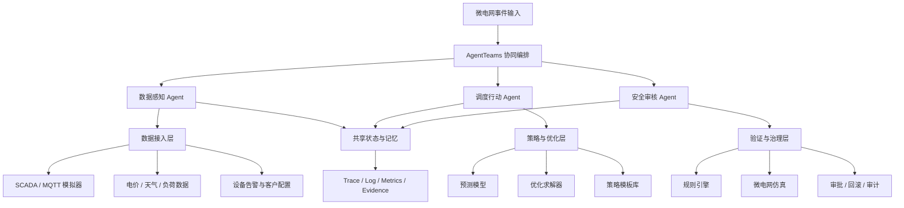

# GridMind 基础架构设计

## 1. 开发意图

从聊天记录看，项目最真实的开发意图不是泛泛地做「AI + 电力」，而是抓住储能和微电网调度里的一个现实痛点：

传统项目里，客户需求经常高度定制化。不同园区、设备、峰谷电价、储能容量、光伏比例、负荷优先级和安全边界不同，工程团队往往需要为每个客户单独写一套策略代码。这个模式交付慢、复用差、解释成本高，后期策略调整也依赖人工。

GridMind 的目标是把「定制策略开发」变成「Agent 辅助策略生成与验证」：

- 数据 Agent 汇总微电网运行状态、客户目标、设备约束和异常事件。
- 调度行动 Agent 基于业务目标生成可执行策略和多套候选方案。
- 审核 Agent 用规则、仿真、审计和审批机制拦截风险。
- 系统沉淀每次策略生成、验证、执行和复盘证据，逐步形成可复用 Skill。

一句话定位：

> GridMind 是面向园区微电网的多 Agent 策略运行基础设施，让储能调度从定制代码走向可验证的策略自动化。

## 2. 场景边界

### 目标场景

工业园区或商业综合体微电网，包含：

- 光伏发电
- 储能电池
- 充电桩
- 可控负荷
- 市电并网点
- 智能电表、传感器、BMS、PCS、EMS 或模拟 SCADA 数据

### 核心任务

在分钟级及以上时间尺度内，系统根据实时数据、客户目标和安全约束，自动完成：

1. 异常感知
2. 调度目标识别
3. 策略生成
4. 安全校验
5. 仿真验证
6. 人工审批
7. 模拟执行
8. 效果核验
9. 复盘沉淀

### 非目标

- 不替代继电保护、PLC、BMS、PCS 等实时控制系统。
- 不让 LLM 直接输出毫秒级控制指令。
- 不以「聊天问答」或「数据看板」作为主要产品形态。

## 3. 三 Agent 基线设计

为了避免方案显得堆 Agent，初赛阶段建议采用 3 个核心 Agent。三者刚好覆盖比赛要求的不同职能，也能讲清楚业务价值。

### 3.1 数据感知 Agent

职责：

- 接收微电网运行数据、设备告警、天气、电价、负荷、客户策略配置。
- 对多源数据做清洗、聚合、异常识别和证据归档。
- 判断当前任务类型：成本优化、削峰填谷、异常处置、保供、低碳优先等。

输入：

- SCADA / EMS / MQTT 模拟数据
- 储能 SOC、SOH、温度、充放电功率
- 光伏出力、负荷曲线、电价
- 设备告警与客户目标

输出：

- 标准化事件包
- 当前运行画像
- 风险等级
- 可供调度 Agent 使用的上下文

### 3.2 调度行动 Agent

职责：

- 根据事件包和客户目标生成调度方案。
- 调用预测、优化、策略模板和仿真工具。
- 输出多套候选策略，如经济优先、稳健优先、低碳优先。
- 对低风险动作生成执行计划，对高风险动作发起审批。

输入：

- 数据感知 Agent 的事件包
- 客户偏好和合同约束
- 设备能力边界
- 历史策略案例

输出：

- 候选调度方案
- 执行步骤
- 预计收益与风险
- 需要审批的动作清单

### 3.3 安全审核 Agent

职责：

- 校验调度方案是否违反硬约束。
- 审核 SOC、功率边界、备用容量、温度、设备寿命、关键负荷保障。
- 调用仿真工具验证方案结果。
- 对高风险策略要求人工确认。
- 生成审计日志、回滚点和复盘报告。

输入：

- 调度行动 Agent 的候选方案
- 安全规则库
- 仿真结果
- 执行反馈

输出：

- 通过 / 否决 / 需人工审批
- 风险解释
- 回滚方案
- 审计证据包
- 复盘结论

## 4. 端到端闭环

示例 Demo 场景：

> 14:00 光伏出力突然下降 35%，一台储能设备出现温度告警，园区即将进入峰值电价时段。客户目标是在不影响关键负荷的前提下降低峰值购电成本。

闭环流程：

1. 数据感知 Agent 汇总光伏、储能、负荷、电价和告警数据。
2. 数据感知 Agent 判断事件为「光伏波动 + 储能风险 + 峰价临近」。
3. 调度行动 Agent 生成三套方案：经济优先、稳健优先、保守保供。
4. 安全审核 Agent 否决过度放电方案，因为会触发温度和 SOC 风险。
5. 调度行动 Agent 改写方案：降低部分非关键负荷，限制告警电池放电功率。
6. 安全审核 Agent 调用仿真验证关键负荷供电、电池边界和峰值功率。
7. 系统向人工发起审批：是否允许 30 分钟非关键负荷降载。
8. 审批通过后，系统在模拟环境执行。
9. 数据感知 Agent 读取执行结果，确认峰值功率下降和设备温度稳定。
10. 安全审核 Agent 生成报告并沉淀为可复用策略案例。

## 5. 技术架构

## 6. 基础模块

### AgentTeams 编排层

- 管理三类 Agent 的身份、任务拆解、上下文传递和状态流转。
- 保存每一步 Agent 输入、输出、工具调用和决策状态。
- 支持异常分支，例如数据缺失、优化失败、仿真失败、审批拒绝。

### 数据接入层

- 初赛和复赛可以先使用模拟数据。
- 接口设计上兼容真实 EMS、SCADA、MQTT、智能电表、BMS 和 PCS。
- 所有输入统一转成事件包，避免 Agent 直接依赖设备私有格式。

### 策略生成层

- LLM 负责理解任务、选择工具、解释策略，不负责直接计算控制功率。
- 优化器负责储能充放电、削峰填谷、需求响应等数值决策。
- 策略模板库沉淀不同行业客户的通用调度偏好。

### 安全验证层

- 规则引擎维护不可突破的硬约束。
- 仿真器验证候选策略是否安全可行。
- 高风险动作必须审批。
- 每次执行必须有回滚方案。

### 证据与观测层

- Trace：记录 Agent 任务链路和工具调用链路。
- Log：记录事件、异常、审批、执行和回滚。
- Metrics：记录成本、峰值、光伏消纳率、执行成功率和风险拦截率。
- Evidence：保存输入数据、策略版本、仿真结果、审批记录和复盘报告。

## 7. Skill 清单

### microgrid_event_ingest

用途：接入并标准化微电网运行数据。

输入：设备数据、告警、电价、天气、客户配置。

输出：标准化事件包。

失败处理：数据缺失时标记置信度，并触发人工检查或降级策略。

安全边界：只读接入，不执行控制。

### dispatch_strategy_generate

用途：根据目标和约束生成候选调度策略。

输入：事件包、客户目标、设备约束、历史案例。

输出：候选策略、收益预测、风险说明。

失败处理：优化失败时返回规则基线方案。

安全边界：不得绕过安全审核 Agent。

### microgrid_simulate_and_verify

用途：对候选策略进行规则校验和仿真验证。

输入：候选策略、电网模型、安全规则。

输出：通过 / 否决 / 需审批，以及仿真证据。

失败处理：仿真不可用时禁止自动执行，只允许人工审核。

安全边界：安全规则优先级高于收益目标。

### approval_and_rollback

用途：管理高风险动作审批、执行确认和回滚方案。

输入：待执行策略、风险等级、审批人、回滚点。

输出：审批结果、执行状态、回滚记录。

失败处理：审批超时或拒绝时进入保守策略。

安全边界：高风险动作无审批不得执行。

### dispatch_postmortem

用途：生成事件复盘并沉淀为策略案例。

输入：事件全链路证据、执行结果、指标变化。

输出：复盘报告、经验规则、策略案例。

失败处理：报告生成失败不影响执行链路，但必须保留原始证据。

安全边界：复盘不得修改历史审计记录。

## 8. MCP 与工具接口

初期可以不直接实现完整 MCP Server，但所有工具都按可迁移到 MCP 的契约设计：

- 工具名称
- 调用入口
- 参数 Schema
- 返回 Schema
- 权限范围
- 幂等键
- 错误码
- 重试策略
- 审计字段

推荐工具：

- 微电网数据模拟器
- 光伏与负荷预测工具
- 储能调度优化工具
- 潮流或微电网仿真工具
- 审批工具
- 审计证据写入工具

## 9. 数据模型草案

核心实体：

- Site：园区或客户站点
- Asset：光伏、储能、充电桩、负荷、并网点
- Event：告警、异常、调度任务
- Constraint：设备约束、合同约束、安全约束
- Strategy：候选策略和执行策略
- SimulationResult：仿真验证结果
- Approval：审批记录
- Execution：执行记录
- EvidencePackage：证据包
- Postmortem：复盘报告

## 10. 关键指标

业务指标：

- 峰值负荷降低比例
- 运行成本降低比例
- 光伏消纳率
- 关键负荷保障率
- 储能 SOC 安全边界保持率

Agent 指标：

- 任务完成率
- 工具调用成功率
- 安全方案拦截率
- 平均处置时间
- 审批命中率
- 回滚成功率

评测方式：

- 同一事件下对比人工规则基线和 GridMind 多 Agent 系统。
- 展示策略收益、风险拦截、执行证据和复盘质量。

## 11. 最小可行 Demo

复赛前建议只做一条完整链路：

1. 使用模拟数据生成光伏骤降、储能温度告警和峰值电价事件。
2. 三个 Agent 通过 AgentTeams 协作处理该事件。
3. 生成三套候选调度方案。
4. 安全审核 Agent 否决一套风险方案。
5. 通过仿真验证保守方案。
6. 触发人工审批。
7. 模拟执行策略。
8. 输出指标变化和复盘报告。

这个 Demo 小，但足以展示多 Agent 协同、工具调用、结果验证、审批、回滚、审计和经验沉淀。

