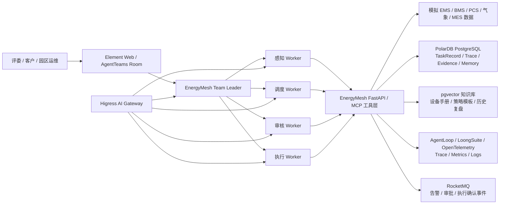

# EnergyMesh Agents 复赛核心方案

本文把复赛材料去重后，只保留评委真正会检查的核心点。

## 1. 最小必选项

复赛不是比谁堆更多云产品，而是证明一个行业任务可以被 AgentTeams 组织成可审计的多 Agent 闭环。

必须讲清楚 5 件事：

1. 以 AgentTeams 为协同基点，至少 3 个不同职能 Agent。
2. 提交 Agent Identity 清单，说明每个 Agent 的身份、能力边界、输入输出和协作关系。
3. 提供可复用 Skill，不只是描述一次性的 Agent 行为。
4. 说明端到端闭环：输入、拆解、上下文传递、工具调用、验证、证据、审批回滚、经验沉淀。
5. 至少覆盖共享状态、可观测、RAG/知识库、记忆沉淀中的关键能力；当前 MVP 已覆盖共享状态和可观测，RAG 作为上云增强。

## 2. 如果接入官方 AgentTeams runtime

当前 EnergyMesh 本地 Demo 的业务闭环由 `EnergyMeshOrchestrator` 执行，AgentTeams 侧已经准备好 Team、Worker、Human、Skill 和 manifest 资产。接入官方 runtime 后，变化不是重写能源算法，而是把调度过程放进 AgentTeams 的可见协作房间和控制平面：

- Team Leader 在 AgentTeams 中接收任务、拆解任务、点名 Worker。
- 感知、调度、审核、执行 Worker 作为 AgentTeams Worker 运行。
- Worker 通过 MCP 或 HTTP 工具调用 EnergyMesh FastAPI 能力。
- Matrix/Element 房间展示任务过程，人工可以旁观、打断、补充或审批。
- MinIO/共享文件、AgentTeams trace、EnergyMesh TaskRecord 共同保存证据。
- Higress 网关集中管理模型、工具 API、鉴权、限流和观测。

因此，上云的意义不是因为代码占用大，而是为了让多 Agent runtime 长驻、可访问、可审计、可恢复。官方本地 quickstart 最小资源较低，多 Worker 推荐更高配置；如果在阿里云做稳定演示，8 核机器合理，因为会同时跑 AgentTeams 控制面、Matrix/Element、Higress、MinIO、多个 Worker、EnergyMesh API、数据库和观测组件。

## 3. 阿里云演示拓扑

推荐复赛演示不要连接真实电力设备，而是在云上模拟外部设备数据，跑完整调度闭环。

云上演示流程：

1. RocketMQ 或 API 注入“负荷突增、光伏低于预测、变压器温度异常、电价高峰将至”。
2. Team Leader 拆成感知、调度、审核、执行任务。
3. 感知 Worker 核验数据可信度和任务是否失效。
4. 调度 Worker 生成多套策略脚本草案和 96 点调度方案。
5. 审核 Worker 静态审查、沙箱回放、复算安全约束和收益。
6. 高风险柔性负荷动作进入人工审批。
7. 执行 Worker 只向模拟 EMS/PCS/load-control 下发幂等命令。
8. 系统保存 trace、metrics、evidence，并把本次经验写入历史复盘库。

## 4. 多 Agent 闭环映射

| 闭环环节 | EnergyMesh 设计 | AgentTeams 映射 |
| --- | --- | --- |
| 任务输入 | 外部数据快照、告警、生产计划变化、人工调度目标 | Team room 中的用户消息或事件触发 |
| 任务拆解 | Team Leader 创建 TaskRecord，分派感知、调度、审核、执行 | Manager/Leader 点名 Workers |
| 上下文传递 | TaskRecord 保存 scenario、perception、plans、audits、approval、trace | Room 消息、共享文件、manifest 和工具结果 |
| 工具调用 | FastAPI/OpenAPI，后续包装为 MCP | Worker 通过 Skill 调用工具 |
| 结果验证 | 审核 Agent 独立复算；执行 Agent 比较计划与实际 | Audit Worker 和 Execution Worker |
| 证据沉淀 | SQLite/PolarDB、JSON evidence、SHA-256、Trace、Metrics | AgentTeams trace + EnergyMesh evidence |
| 审批回滚 | 柔性负荷需人工审批；偏差超过 5% safe fallback | Human resource + approval Skill |
| 经验沉淀 | 历史任务、策略脚本、事故复盘进入 RAG/记忆库 | 可复用 Skill 与知识库 |

## 5. Agent Identity 最小清单

| Agent | 身份 | 核心能力 | 禁止事项 |
| --- | --- | --- | --- |
| Team Leader | 园区能源调度主控 | 接收任务、拆解任务、维护状态、请求审批 | 不直接写设备，不绕过审核 |
| 感知 Agent | 运行上下文核验 | 核验 EMS/BMS/PCS/气象/MES 数据，发现冲突和缺失 | 不生成控制指令 |
| 调度 Agent | 策略生成 | 生成受限策略脚本草案和候选计划 | 不执行设备动作，不访问网络和文件 |
| 审核 Agent | 独立安全审计 | 静态审查、沙箱回放、复算硬约束和收益 | 不因收益覆盖安全约束 |
| 执行 Agent | 获批计划映射 | 生成幂等模拟命令、验证偏差、触发回退 | 当前 MVP 不接触真实设备 |
| Human Operator | 高风险审批人 | 审批柔性负荷、生产影响动作和回退接管 | 审批不得跨任务复用 |

## 6. 核心 Skill 清单

| Skill | 用途 | 输入 | 输出 | 失败处理 | 复用价值 |
| --- | --- | --- | --- | --- | --- |
| `microgrid_context_ingest` | 汇总并核验园区运行上下文 | 外部数据快照、设备状态、生产计划 | 可信上下文、异常、冲突、目标优先级 | 缺失或冲突进入 human_handoff | 可复用于园区、工厂、数据中心、充储站 |
| `dispatch_plan_generate` | 生成受限策略脚本和候选调度方案 | 可信场景、约束、目标优先级、基线策略 | 策略脚本草案、96 点计划、成本指标 | 不可行则 failed，不产生命令 | 可替换优化器，保留统一计划契约 |
| `dispatch_audit_verify` | 独立验证策略和计划 | 脚本草案、候选计划、基线计划、场景 | 审核结论、风险项、收益复算 | fail closed，不可验证即拒绝 | 可作为能源调度通用审计器 |
| `execution_mapping` | 把获批计划映射为幂等命令 | 获批计划、审批记录、基线计划 | 模拟 EMS/PCS/负荷命令、执行摘要 | 偏差超限 safe fallback | 可替换真实设备 adapter |
| `approval_rollback` | 管理审批、拒绝、变化重调度和回退 | task_id、审批请求、执行摘要 | 审批记录、回退状态、证据哈希 | 非当前任务审批无效 | 适用于高风险 Agent 执行门禁 |

## 7. 当前已有与复赛缺口

已有：

- 5 个 Agent 身份，超过至少 3 个 Agent 的要求。
- AgentTeams Team/Worker/Human 声明资源、Worker 包、Skill 包和 `/api/agentteams/manifest`。
- 本地 FastAPI 演示闭环、极简调度工作台、96 点曲线、审批 gate、安全回退。
- TaskRecord 共享状态、trace、metrics、SQLite、JSON evidence SHA-256。
- Skill 契约和 Agent Identity 文档。

仍需增强：

- 在真实 AgentTeams quickstart 或 Helm 环境中 apply `agentteams/agentteams-resources.yaml`。
- 把 FastAPI 工具包装成 MCP Server，至少提供 snapshot、dispatch、approval、task retrieval。
- 上云时把 SQLite 换成 PolarDB PostgreSQL，并增加 pgvector RAG 表。
- 接入 AgentLoop/LoongSuite 或 OpenTelemetry，把每次 Agent/Skill 调用记录为 span。
- 录制云上演示：AgentTeams 房间可见协同 + EnergyMesh 控制台可见调度效果。

## 8. 客户讲解的一句话

EnergyMesh Agents 不是替代 EMS，而是在 EMS 之上用 AgentTeams 组织一个可审计的能源调度团队：感知 Agent 判断现实变化，调度 Agent 生成策略，审核 Agent 独立验证，执行 Agent 只执行获批方案，所有过程有审批、有回退、有证据，并且能把经验沉淀成可复用 Skill。
