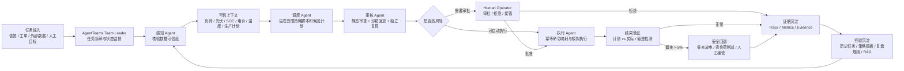

# EnergyMesh Agents 标准响应稿

本文按复赛评分标准重写 EnergyMesh Agents 的核心说明，避免重复堆料，只回答评委真正会问的问题。

## 0. 当前 AgentTeams 使用状态

EnergyMesh 当前**有基于 AgentTeams 做协同设计和资源映射**，但**还没有完成由官方 AgentTeams runtime 实际调度的 live apply 验证**。

已经做到：

- 提供 AgentTeams 声明式资源：`agentteams/agentteams-resources.yaml`。
- 提供 Team Leader、Human、四类 Worker 包：`agentteams/team-leader`、`agentteams/workers/*`。
- 提供 5 个可复用 Skill：`agentteams/skills/*/SKILL.md`。
- 提供 `/api/agentteams/manifest`，把本地业务 Agent 映射成 AgentTeams Worker。
- 本地业务闭环已经可运行：`EnergyMeshOrchestrator` 串起感知、调度、审核、审批、执行和回退。

还没做到：

- 尚未把 `agentteams/agentteams-resources.yaml` apply 到真实 AgentTeams quickstart 或 Helm 集群。
- 尚未让 AgentTeams Matrix room 中的 Team Leader 真实点名 Worker 并调用 EnergyMesh 工具完成完整任务。

准确表述：

> 当前版本是 AgentTeams-ready：业务闭环可独立运行，AgentTeams 的 Team/Worker/Skill/Human 资产已经准备好。复赛上云要补的是官方 runtime apply 和房间内真实协作演示，而不是重写能源调度算法。

## 1. 场景价值与行业可复制性

EnergyMesh 面向工商业园区、工业中心、算力中心和充储一体站的源网荷储协同调度。它解决的不是“再做一个 EMS”，而是 EMS 之上的现实变化处理问题。

传统 EMS 的问题：

- 固定规则 EMS 依赖工程师预设峰谷电价、SOC 阈值和充放电时段。
- 高级 EMS 可以优化，但通常要求目标和约束已经被正确设定。
- 现实中负荷、光伏、储能 SOC、电价、生产计划和设备温度会同时变化，原任务可能失效。

EnergyMesh 的价值：

- 感知 Agent 判断原任务是否还成立。
- 调度 Agent 生成新策略，而不是只套旧规则。
- 审核 Agent 独立验证安全约束和经济收益。
- 执行 Agent 只执行获批结果，并持续验证偏差。
- 所有过程沉淀为 Trace、Metrics、Evidence 和可复用 Skill。

可复制行业：

- 工商业园区：光伏、储能、柔性负荷调度。
- 数据中心：算力负荷、制冷、储能和供电容量协同。
- 工厂：生产计划变化下的能源调度。
- 充储一体站：充电负荷、储能套利和电网容量约束。
- 虚拟电厂局部节点：站点级策略生成、审核和执行证据沉淀。

## 2. 多 Agent 闭环架构图

闭环讲解：

1. 任务输入：系统接收外部数据变化，例如光伏低于预测、负荷突增、变压器温度异常、生产计划不可中断。
2. 任务拆解：Team Leader 创建任务，把数据核验交给感知 Agent，把策略生成交给调度 Agent，把安全验证交给审核 Agent，把执行确认交给执行 Agent。
3. 上下文传递：所有中间结果写入 `TaskRecord`，包括 scenario、perception、plans、audits、approval、trace、execution_summary。
4. 工具调用：Agent 通过 Skill 调用 EnergyMesh 工具层，当前是 FastAPI/OpenAPI，复赛可包装成 MCP Server。
5. 结果验证：审核 Agent 在执行前验证硬约束，执行 Agent 在执行后验证计划与实际偏差。
6. 证据沉淀：SQLite/PolarDB 保存任务状态，JSON evidence 保存 SHA-256 证据包，Trace/Metrics 支撑复盘。
7. 审批与回滚：柔性负荷、生产影响、高风险动作必须人工审批；偏差超过阈值进入 safe fallback。
8. 经验沉淀：把策略脚本、失败原因、审批记录和事故复盘写入知识库，供后续任务检索。

## 3. Agent Identity 清单

| Agent | AgentTeams 身份 | 本地 actor | 身份定义 | 输入 | 输出 | 能力边界 | 协作关系 |
| --- | --- | --- | --- | --- | --- | --- | --- |
| EnergyMesh Team Leader | `energymesh_team_leader` | `orchestrator` | 园区能源调度主控 Agent | 外部任务、人工目标、历史任务、审批状态 | 任务拆解、Worker 调用顺序、状态更新、审批请求 | 不直接生成设备指令，不绕过审核和审批 | 串联感知、调度、审核、执行和人工 |
| 感知 Agent | `perception_worker` | `perception_agent` | 能源运行上下文核验 Agent | EMS/BMS/PCS/气象/MES 数据、生产计划、设备状态 | `PerceptionReport`、异常、冲突、目标优先级、所需工具 | 只读；数据缺失或传感器冲突时必须 human_handoff | 向调度 Agent 交付可信上下文 |
| 调度 Agent | `dispatch_worker` | `dispatch_agent` | 策略脚本生成和多方案比较 Agent | 可信场景、站点约束、目标优先级、原 EMS 基线 | 策略脚本草案、候选计划、96 点调度曲线、成本指标 | 不执行设备动作，不审批，不访问网络和文件 | 向审核 Agent 交付脚本、计划和假设 |
| 审核 Agent | `audit_worker` | `audit_agent` | 独立安全审计 Agent | 候选计划、脚本草案、场景、基线计划 | `AuditReport`、approved/rejected/requires_approval、风险项、收益复算 | fail closed；收益不能覆盖硬安全约束 | 决定方案是否可选、是否需要人工审批 |
| 执行 Agent | `execution_worker` | `execution_agent` | 获批计划映射、模拟执行和偏差验证 Agent | 获批计划、审核结论、approval_id、基线计划 | EMS/PCS/负荷幂等命令、执行摘要、偏差、回退状态 | 当前真实设备接触数必须为 0；生产写入关闭 | 接收审核和审批结果，输出执行证据 |
| Human Operator | `park-operator` | `human_approver` | 高风险动作审批人与接管者 | 审核摘要、影响范围、证据包 | `ApprovalRecord`、批准/拒绝/接管意见 | 审批只对当前 task_id 有效，变化后不得复用 | 与 Team Leader 共同完成审批和回滚 |

## 4. Skill 清单

| Skill | 用途 | 输入 | 输出 | 调用条件 | 依赖工具 | 失败处理 | 安全边界 | 复用价值 |
| --- | --- | --- | --- | --- | --- | --- | --- | --- |
| `microgrid_context_ingest` | 接入并核验微电网上下文 | 96 点 forecast、站点约束、设备状态、告警、生产计划 | 数据完整性、质量分、异常、冲突、目标优先级、所需工具 | 外部数据快照可用后，优化前 | `/api/external/snapshot`、`PerceptionAgent` | 缺字段、时间序列异常、传感器冲突时阻断自动调度 | 只读，不产生控制指令 | 适用于园区、工厂、数据中心、充储站 |
| `dispatch_plan_generate` | 生成受限策略脚本和候选调度计划 | 可信场景、目标优先级、安全边界、原 EMS 基线 | 策略脚本、三类候选计划、96 点动作、成本和峰值指标 | 感知报告可信且无需人工接管 | `DispatchOptimizer`、`scipy.optimize.milp`、`/api/external/dispatch` | 脚本或优化不可行时 failed，不输出命令 | 只生成计划，不审批、不执行、不联网、不读写文件 | 可替换优化器，保留统一计划契约 |
| `dispatch_audit_verify` | 独立审查候选计划 | 场景、候选计划、基线计划、脚本假设 | 审核结论、风险项、复算规则、收益对比 | 候选计划生成后，选择和执行前 | `IndependentSafetyAuditor`、`TaskRecord.audits` | critical finding 直接 rejected；柔性负荷进入审批 | fail closed，不可验证即拒绝 | 可作为能源调度通用安全审计器 |
| `execution_mapping` | 把获批计划映射为幂等执行命令 | 选中计划、审核结论、基线计划、approval_id | EMS/PCS/load-control 命令、执行确认、偏差、回退状态 | 审核通过，或审批通过 | `SimulationExecutor`、`Settings.assert_safe_runtime` | 生产写入被阻断；偏差超限 safe fallback | MVP 只模拟，真实设备接触数为 0 | 未来可替换真实 EMS/PCS adapter |
| `approval_rollback` | 管理审批、拒绝、变化重调度和回退 | 当前任务、审核结论、审批请求、执行摘要、变化触发器 | 审批记录、拒绝/完成/回退/接管状态、证据哈希 | 高风险动作、审批拒绝、执行偏差、外部变化 | `/api/tasks/{id}/approval`、`/api/tasks/{id}/reoptimize`、`EvidenceStore` | 非待审批状态拒绝；子任务必须重新审批 | 旧审批不得复用；回退不得增加风险 | 适用于运维、安全、能源等高风险 Agent 执行门禁 |

## 5. MCP、RAG、可观测性的实际用途

### MCP

MCP 的作用不是为了“多一个技术名词”，而是把 EnergyMesh 的业务工具标准化，让 AgentTeams Worker 可以稳定调用。

建议包装 4 类 MCP tool：

- `external_energy_snapshot`：读取模拟 EMS/BMS/PCS/气象/MES 数据。
- `dispatch_from_external_context`：根据外部上下文创建调度任务。
- `approve_or_reject_dispatch`：提交人工审批结果。
- `get_task_evidence`：读取任务、trace、metrics、evidence。

当前项目状态：已经有等价 FastAPI/OpenAPI 端点，尚未封装成 live MCP Server。

### RAG

RAG 的作用是让 Agent 不只看本次数据，还能检索站点规则和历史经验。

适合放入 RAG 的内容：

- 设备手册：PCS 限制、储能温控要求、变压器热降额规则。
- 站点策略：不同园区的审批规则、生产保供等级、负荷可调清单。
- 历史任务：哪些策略曾失败、哪些审批被拒、哪些异常触发过回退。
- 事故复盘：温度传感器冲突、预测偏差、执行偏差的处理规则。

实际使用方式：

- 感知 Agent 检索“这个告警意味着什么、哪些数据必须二次确认”。
- 调度 Agent 检索“该站点允许哪些柔性负荷动作”。
- 审核 Agent 检索“本客户的审批阈值和禁止动作”。
- Team Leader 把本次 evidence 写回历史复盘库。

当前项目状态：未实现 live RAG；已设计 PolarDB PostgreSQL + pgvector 作为复赛增强。

### 可观测性

可观测性的作用是证明 Agent 为什么这么做、哪里失败、效果如何，而不是只给一个最终答案。

应记录：

- Trace：每个 Agent/Skill 的调用顺序、输入摘要、输出摘要、状态变化。
- Metrics：成本降低、峰值削减、光伏自用率、SOC 约束、偏差时段、审批耗时、模型调用耗时。
- Logs：工具调用、错误、回退触发原因。
- Evidence：JSON 证据包、SHA-256、审批记录、执行命令和确认结果。

当前项目状态：

- 已有 `TaskRecord.trace`、SQLite、JSON evidence、PlanMetrics、execution_summary。
- 复赛可接入 AgentLoop/LoongSuite 或 OpenTelemetry，把每个 Agent/Skill 调用上报为 span。

## 6. 真实 AgentTeams runtime apply 是否必须跑在云上

不必须。

官方 AgentTeams 有两种验证方式：

- 本地 quickstart：适合开发和单人验证，可在本机 Docker 跑 Element、Matrix、网关、存储、Manager 和 Worker。
- Kubernetes/Helm：适合共享演示、多人访问、长期运行和生产化部署。

复赛建议跑在云上，原因不是资源体积，而是演示质量：

- 评委和客户可以公网访问 Element Web 和 EnergyMesh 控制台。
- AgentTeams、EnergyMesh API、数据库、RAG、观测组件可以长驻。
- 模型密钥和工具 API 通过 Higress 管理，避免散落在 Worker 中。
- 证据、日志、trace、metrics 可以持久保存，演示不依赖本地电脑。

推荐云上最小演示：

- 一台 8 核云服务器或小型 K8s 集群。
- AgentTeams Helm 或 quickstart。
- EnergyMesh FastAPI 服务。
- PostgreSQL/PolarDB 保存任务、证据和模型配置。
- 可选 pgvector RAG。
- 可选 OpenTelemetry/AgentLoop/LoongSuite 可观测。

## 7. 对外讲解口径

一句话版本：

> EnergyMesh Agents 用 AgentTeams 组织一个能源调度团队：Team Leader 负责任务拆解，感知 Agent 判断现实变化，调度 Agent 生成策略脚本，审核 Agent 独立验证安全和收益，执行 Agent 只执行获批方案。全过程有 MCP 工具调用、RAG 经验检索、Trace/Metrics/Evidence 审计、人工审批和安全回退。

当前边界版本：

> 目前项目已经完成 EnergyMesh 本地业务闭环和 AgentTeams 资源/Worker/Skill 映射；还没有完成官方 AgentTeams runtime 的真实 apply 调度。复赛上云的重点，是把这些资源加载进 AgentTeams，让房间里的 Team Leader 和 Workers 真实协作调用 EnergyMesh 工具，并把过程接入 MCP、RAG 和可观测链路。

